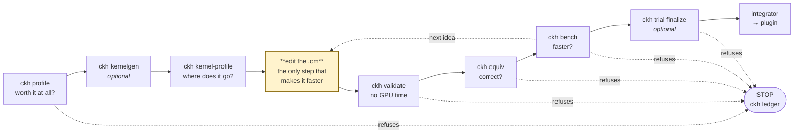

# cm-kernel-harness

Measurement, verification and calibration harness for Intel CM (C-for-Metal) GPU kernels.
Kernels stay in their own repos; this repo holds the **method**, the **tooling** and the
**findings**.

→ **Optimizing a kernel?** — [Quickstart](#quickstart) gets you measuring in a few minutes.
→ **Onboarding a kernel you did not write?** — [`docs/ONBOARDING.md`](docs/ONBOARDING.md) is
the step-by-step path, including which steps have tool support today and which are manual.

## How it Works

An LLM (Copilot / Claude Code) drives the optimization loop, but every gate in it is enforced
by a tool rather than by a prompt — the model cannot talk its way past a noise floor or a
vacuous test:

- **`ckh doctor`** — validates the environment: config, that `clops` resolves, and whether
  competing GPU work is running. Nothing below it is trustworthy without it.
- **`ckh profile`** — runs the **real pipeline** under cl_intercept, splits the device
  timeline into prefill/generate, and reports each kernel's share of its phase. This is the
  Amdahl ceiling: it decides whether the kernel is worth optimizing at all.
- **`ckh kernelgen`** *(optional)* — the kernel `profile` named lives in the plugin tree and
  will not build outside it. This ports it into the sandbox with its include closure, and
  scaffolds a spec and a compile test. It **derives** what the `.cm` states outright, marks
  everything lifted from host C++ as a `GUESS`, and refuses to invent input data. Skip it
  entirely if you already have a sandbox kernel.
- **`ckh validate`** — everything that can be wrong **before any GPU time is spent**: unset
  jit values, malformed or indivisible `gws`/`lws`, spec-declared kernel constraints, device
  work-group limits, argument arity against the ported signature, and a real compile. It
  compiles but never enqueues, so it is the one command that stays useful while the GPU is busy.
- **`ckh bench`** — interleaved min-of-N over a shape grid and over A/B variants in one
  batch. Reports device time **and** wall-clock, and **flags any config whose spread exceeds
  the noise floor**. `--verify` runs the reference check first and refuses to report timings
  if it fails.
- **`ckh kernel-profile`** — where the kernel spends itself, from the IGC assembly dump,
  weighted by **pipe cycles rather than instruction count**. Hardware counters would be
  better; on the reference box they were unavailable entirely, and this is what replaced
  them. Emits hypotheses with their evidence, never conclusions.
- **`ckh equiv`** — checks a kernel against its declared reference (`TorchReference` = an
  independent torch ground truth, or `KernelReference` = another compiled kernel), with a
  required `non_vacuous` note so a test that cannot fail is rejected at authoring time.
- **`ckh snapshot` / `ckh round`** — capture a kernel revision and run a full A/B round
  against it, so a comparison is a command rather than a model re-reading logs.
- **`ckh trial`** — a branching trial tree over the loop above. Each trial runs
  validate → equiv → bench in **cost order, short-circuiting**, and `finalize`
  **re-measures** the shortlist against the baseline in one interleaved batch rather than
  trusting stored numbers.
- **`ckh ledger`** — append-only findings store, including **negatives** and whether they
  were rejected on *measurement* or on *policy*. Read it before prototyping anything.



**Only one box makes the kernel faster.** Everything else exists to stop you fooling yourself
about whether it did — which is the whole reason this repo exists, since roughly half the
effort in the pass it was distilled from went into wrong hypotheses and self-inflicted
regressions. `kernel-profile` sits immediately before the edit because its job is to say
*where* to edit; `validate` / `equiv` / `bench` sit immediately after because their job is to
say whether the edit was worth keeping.

Each stage can refuse, and the refusal is the point — every one of them fired at least once in
the pass this was distilled from:

| stage | refuses when | because |
|---|---|---|
| `profile` | the kernel is a small share of its phase | the Amdahl ceiling caps any e2e win |
| `validate` | jit unset, `gws` not divisible by `lws`, constraint violated | none of these raise at runtime; they just make every later number describe something else |
| `equiv` | output disagrees with the reference | a timing number from a wrong kernel is noise with units |
| `bench` | the difference is inside the measured spread | not resolvable is not the same as no change |
| `trial finalize` | a fresh interleaved re-measurement contradicts the stored deltas | the box drifts ~2×; stored milliseconds shortlist, they do not rank |

`doctor` gates all of them: anything else on the GPU and `bench`/`equiv`/`round` refuse to run
at all. `validate` and `kernel-profile` are the exceptions — they compile but never enqueue,
so they stay useful on a busy box.

`trial finalize` is marked optional for the same reason `kernelgen` is: it only exists once
you are keeping score across several candidates. A single edit measured with `ckh round`
never needs it.

The **knowledge base** (`kb/`) carries the expertise the loop consults: correctness
constraints, memory-access and fusion patterns, XPU/Xe-specific tuning, and harness-design
patterns, split by concern (`kb/README.md`). The **method** lives in `.claude/`: eleven roles
in `.claude/agents/` and the flow with its gates in `.claude/skills/cm-kernel-opt/WORKFLOW.md`.

Each candidate change runs the same circuit — classify it as bit-exact or not, implement,
prove equivalence non-vacuously, measure interleaved, then record the verdict *with its
numbers* in `ledger/<kernel>.jsonl`. Findings also live in the kernel's own comment ledger,
so a rejected idea is never re-tried blind.

## Quickstart

```bash
cp platform.example.toml platform.toml   # the only machine-specific file
$EDITOR platform.toml                    # point it at your kernel repos
pip install -e .

ckh doctor                               # validate env, check clops resolves, check for competing GPU work
ckh ledger pa_small_q --only rejected    # READ THIS FIRST -- what is already settled
ckh profile setup                        # e2e first: is this kernel even worth optimizing?
ckh kernelgen cm_pa_small_q              # optional: plugin kernel -> sandbox + scaffolding
ckh validate pa_small_q                  # before any GPU time: spec, dispatch, constraints, compile
ckh kernel-profile pa_small_q --axis q_len=16   # pipe-cycle budget from the IGC dump
ckh bench pa_small_q --axis q_len=6,16   # interleaved min-of-N over a shape grid
ckh bench pa_small_q --verify            # ... with the reference check gating the timings
ckh equiv pa_small_q --axis q_len=6      # check the kernel against its declared reference
```

## Before optimizing anything: `ckh profile`

A kernel 3x off its roofline that is 2% of the phase is not worth a week. `ckh profile` runs
the **real pipeline** under cl_intercept, splits the device timeline into prefill and
generate, and prints each kernel's share of its phase — the Amdahl ceiling on any e2e win.

```bash
ckh profile setup --install                                  # find or bootstrap cliloader
ckh profile run --out-dir results/profile --repeat 2 -- <your pipeline command>
ckh profile report --dump-dir results/profile --kernel pa_small_q
```

```
generate   3479.71 ms over   8532 calls  =  37.2% of the phase   -> Amdahl ceiling: 37.2%
```

The split is a decision, not a fact, so the report states the anchor and gap that produced it
and warns when the anchor leaks across the boundary. `clEnqueue*` memory ops are excluded from
kernel totals, and the concurrency factor is printed so a share of *device work* is never
mistaken for a share of wall time. Zero matches for the named kernel is reported as a
**configuration** result — it was never enqueued — not as a performance one.

## Before spending GPU time at all: `ckh validate`

A dispatch whose `gws` is not a multiple of its `lws` does not raise. It quietly rounds, and
every number afterwards describes a different grid than the one you think you measured. Same
for a jit macro left at `None`: `-DFOO=None` is a valid C identifier in plenty of contexts.
These are cheap to find and expensive to believe.

```bash
ckh validate pa_small_q                  # static + device limits + a real compile
ckh validate pa_small_q --static-only    # pure spec arithmetic, no clops, no GPU
```

```
q_len=16 past_len=15360 partition=500 cmpr=2 block=256
  ERROR  constraint-violated: partition_divides_kv_step: KV_PARTITION_SIZE=500 is not a
         multiple of KV_STEP=16

1 error(s), 0 warning(s) -- do NOT measure this yet. A bench run on an invalid dispatch
produces a number, not an error.
```

It compiles but **never enqueues**, which is why it is the one command that stays useful
while the GPU is busy — no `competing_gpu_work` refusal.

Kernel-specific rules live on the spec (`KernelSpec.constraints`), not in the validator,
because they are facts about *one* kernel. That distinction has already earned its keep: a
`Q_head_chunk_size * TILE_Q <= 8` DPAS RepeatCount rule, lifted from the **shipped** kernel's
comments, fired on every known-good shape of the **sandbox** kernel — which spreads `Q_ROWS`
over `wg_threads` at 8 rows each, so the cap is per-thread and satisfied by construction. The
sandbox kernel is not the shipped kernel; a hardcoded rule would have made that permanent.

## Which command when — the overlaps are deliberate

Several commands measure the same things. The division is by *what you already have* and
*what you are willing to pay*, and it is worth stating because the overlap looks accidental:

| you have | you want | use |
|---|---|---|
| a spec, nothing measured | is it even correct? | `ckh equiv` — no timing, so it is cheap |
| a spec | timing, and don't want a wrong kernel's number | `ckh bench --verify` — runs `equiv` first and refuses to time a failure |
| uncommitted edits | did this help, across the whole grid? | `ckh round --against <tag>` — one-off A/B, no tree |
| a line of enquiry | many candidates, budgeted, with a winner | `ckh trial` |

`ckh bench --verify` does **not** make `ckh equiv` redundant: it calls it. Keeping it separate
means a correctness question does not cost a full timing batch, and `ckh trial`'s gate reuses
the same code path.

`ckh snapshot` is not a user-facing duplicate of `ckh trial` either — `trial init`/`trial new`
call it to pin each node's source. That pinning is what makes `trial finalize` able to
re-measure an old candidate at all.

`ckh round` and `ckh trial run` genuinely overlap: both A/B a pinned source against another.
`round` is the tree-less form, and it takes the **working tree** as one side, so it needs no
snapshot of the candidate. Use it while iterating; use `trial` once you are keeping score.

Both score the **worst shape**, not the average — a candidate that improves one shape and
breaks another is a regression. That is not a stylistic choice: it has happened twice here (a
partition tuned at long context regressed short context by 3.3×). `trial run` originally
collapsed the grid by taking each source's best row, which would have called the example
below an improvement; it now shares `bench.round_deltas` with `render_round` so the two cannot
diverge.

```
shape       base       cand     delta   noise
q=6       1.000      0.800    -20.0%    2.0%  improved
q=16      1.000      1.300    +30.0%    2.0%  <- REGRESSION
1 improved, 1 REGRESSED, 0 inconclusive -> NOT shippable: fix or scope the regression first
```

## Running it as a loop: `ckh trial`

A branching trial tree, in the familiar shape — generate a candidate, gate it, use the result
to choose the next one, finalize the best.

```bash
ckh trial init pa_small_q --max-trials 10   # pin the current source as the baseline
ckh trial new pa_small_q --label "coop marshal" --from 0
ckh trial run pa_small_q 1                  # validate -> equiv -> bench, short-circuiting
ckh trial status pa_small_q
ckh trial finalize pa_small_q --top 3
```

```
pa_small_q: 3/10 trials used
   [0] baseline                    open
++   [1] coop marshal                improved       -4.1% vs trial0 (res 2.0%)
xx     [2] fold dequant              invalid        3 validation error(s)
??   [3] vec rowmax                  inconclusive   -1.2% vs trial0 (res 2.0%)
```

Two things differ from a plain generate-and-measure loop, and both come from failures in this
repo's ledger.

**A stored millisecond is not a comparable millisecond.** The reference box drifts ~2× within
a session — the same config measured 0.52 ms early and 1.59 ms late. A tree that picks its
winner by sorting recorded numbers picks whichever trial ran when the box was coldest. So
recorded deltas here **shortlist only**. Every node pins its own source snapshot, and
`finalize` re-measures the shortlist *and* the baseline together in one interleaved batch,
then decides on that. It will tell you when the fresh measurement contradicts the stored
deltas, and refuse to crown anything when the best candidate is inside the rig's resolution:

```
every candidate re-measured slower than the baseline (best trial1 +8.0%). The recorded
per-trial deltas disagreed with this, which is what re-measuring exists to catch
```

**The gates stay in the loop.** validate → equiv → bench, in that order because that is
increasing cost: an invalid candidate never reaches the GPU, and an incorrect one never
produces a timing number that could be quoted later. A passing `equiv` whose reference has no
`non_vacuous` note is marked in the tree rather than counted as evidence.

`--max-trials` is a budget, not a formality. Branching from a node already marked
`regressed`/`invalid`/`incorrect` is refused — building on a candidate shown not to work is
how a tree spends ten trials exploring a dead branch.

## Where the kernel spends itself: `ckh kernel-profile`

Hardware counters are the obvious way to answer this. On the reference box unitrace could not
be made to run at all, so the analysis that produced this project's results was built on the
IGC assembly dump instead. This generalizes it over any `KernelSpec`.

```bash
ckh kernel-profile pa_small_q --axis q_len=16 --axis past_len=15360
ckh kernel-profile --asm cm_pa_small_q.asm      # analyse an existing dump
```

```
registers  GRF count 243 of 256   no spill
size       8474 instructions (header), 8323 parsed (98.2% covered)
scope      main loop [5544:6893], 1350 instructions, 632 branched over at this shape
           (largest of 21 back-edges)
NOTE       more than one loop nest exists; the largest span was scoped to, which is a guess

category          instrs   cycles   % loop  % kernel
move                 411      667    64.8%     54.6%
systolic               8       64     6.2%      1.3%

[move-bound]   (loop) move ops are 65% of pipe cycles (411 instructions)
[ieee-divide]  (whole kernel) 448 madm -- the IEEE divide/sqrt macro-sequence
```

Two decisions carried over from the one-off script, both of which changed conclusions:

**Cycles, not instructions.** At a 16-wide ALU an exec-32 op costs 2 cycles and an exec-1 op
costs 1. A change that *cut instruction count and raised cycle count* measured **+1.0% —
slower**. Ranking by instruction count would have recommended it.

**Executed, not static.** Blocks the shape branches over — a causal-mask path, a lazy-rescale
body — are in the dump and not in the run. Counting them misattributes a large fraction of
the kernel.

Three things it refuses to hide: parse coverage (and a warning below 95%), how many
back-edges it chose between (the loop scoping is a guess, not a measurement), and the
loop-scoped share next to the whole-kernel share, so a term that is large in one and small in
the other is visible rather than averaged away. That column is load-bearing — it is what
surfaces the 448-instruction IEEE-divide sequence that sits entirely *outside* the KV loop.

Every finding is a **hypothesis with its evidence attached**. This codebase's history is four
confident hypotheses in a row that were wrong; `ckh bench` remains the only thing that
settles one.

## Getting the kernel out of the plugin: `ckh kernelgen` (optional)

`ckh profile` names a kernel, but that name is an OpenCL entry point on a device timeline.
The thing you actually edit is a `.cm` in the plugin tree, and it will not compile outside
it: it pulls plugin-private headers, its entry point is a macro, and every shape constant
arrives as a `-D` from host C++.

```bash
ckh kernelgen cm_pa_small_q                     # search, confirm, port
ckh kernelgen cm_pa_small_q --source <path.cm> --generator PagedAttentionGeneratorSmallQ --yes
```

```
source     .../impls/cm/pa_small_q.cm
entry      cm_pa_small_q  (14 params)
includes   1 resolved
needs -D   CLEAN_UNUSED_KVCACHE HAS_QQ_BIAS HEADS_NUM HEAD_SIZE KV_BLOCK_SIZE ... XE_ARCH
host       paged_attention_gen.cpp::PagedAttentionGeneratorSmallQ
```

What it produces is deliberately **incomplete**, and the three tiers are labelled in the
generated files themselves:

| | |
|---|---|
| **DERIVED** | entry signature (in order, with `#if` guards), transitive include closure, the full `-D` list. |
| **GUESS** | jit values and `gws`/`lws`, regex-lifted from the generator class in the host `.cpp`. That is C++ branching on runtime state and reading env vars, so each is emitted as a *commented expression*, never as a number. |
| **REFUSED** | input tensors. There is no honest way to invent them, so the generated test **skips** its launch case rather than fabricating data that would make a wrong kernel look fine. |

The `-D` list is built from two directions because neither is sufficient: a preprocessor scan
cannot see a constant used only in ordinary code (`HEAD_SIZE`), and the host's jit list also
carries constants belonging to sibling kernels in the same file. The union, filtered by
whether the source actually mentions the name, reproduced `pa_small_q`'s hand-written
13-macro compile line exactly — plus two the hand-written one had folded into defaults.

The first generated artifact is a sandbox pytest whose first case is real work: **does the
port compile at all?** That is where ports actually fail — a header that did not come along,
a macro nobody wrote down — and it is answerable without knowing a single input value.
`.claude/agents/kernel-onboarder.md` picks up from there for dispatch, inputs, args and the
reference.

## Driving it from Copilot (MCP)

The same commands are exposed as MCP tools, so a model can run the loop instead of a human
relaying CLI output into a chat. The server must live **on the box with the GPU** — every
tool compiles and runs a CM kernel — so there are two lanes:

```bash
cp .env.example .env
bash deploy/deploy_ckh.sh --local    # GPU is in this box  -> stdio, nothing on a socket
bash deploy/deploy_ckh.sh            # CKH_REMOTE_HOST set -> rsync + venv + systemd + HTTP
```

Both render `.vscode/mcp.json` from a committed template, so the server location has one
source of truth (`.env`). Tools: `doctor`, `list_kernels`, `bench`, `equiv`, `snapshot`,
`round`, `ledger_query`, `ledger_add`, `profile_status`, `profile_report`. Details and the
security posture (the port is a remote-execution primitive, so the remote lane refuses to
deploy without `MCP_AUTH_TOKEN`) are in [deploy/README.md](deploy/README.md).

`ckh profile run` is deliberately **not** an MCP tool: it executes an arbitrary user-supplied
pipeline command, which over a socket would be a second remote-execution primitive. Collection
stays on the CLI; the model gets detection and analysis.

`ckh kernelgen` is not one either, for a different reason: it writes into two repos and its
whole value is the human confirming *which* kernel before anything is copied. It is a CLI
step by design.

The refusals are in the server, not in the prompt: `bench` / `equiv` / `round` raise rather
than measure while competing GPU work is running, and a kernel name that is not a plain
module name is rejected before it reaches `importlib`. `tests/test_mcp.py` covers the
handshake, the schemas and both refusals — a broken MCP server otherwise fails silently,
looking exactly like a model that chose not to call anything.


## Why it is shaped like this

Distilled from an optimization pass on `pa_small_q` where roughly half the effort went into
wrong hypotheses, self-inflicted regressions and tests that silently proved nothing. Three
design goals follow directly:

**Not tied to one sandbox repo.** Every measurement ultimately calls `clops` to compile/run a
CM kernel; that used to only resolve because it happened to live inside the reference
sandbox (aboutSHW). `exec.clops_path` in `platform.toml` now points at wherever your own
`clops`-providing checkout is, independently of `repos.sandbox` (the kernel *source* you're
optimizing) -- or leave it unset and `pip install -e <path>/opencl` once, outside this
config, if you'd rather have a normal installed `clops`. `ckh doctor` reports which one
actually resolved and fails loudly if neither does.

**Reusable across kernels.** Everything kernel-specific lives in one descriptor
(`kernels/<name>.py`): signature, jit defines, shape axes, dispatch, input generation, and
now a `reference` — either a `TorchReference` (independent Python/torch ground truth) or a
`KernelReference` (another compiled kernel as baseline). `bench` and `equiv` are generic over
it; `ablate` / `sweep` still need to be. Adopting a new kernel means writing a descriptor, not
another one-off script — the previous approach re-derived the same facts by grepping a
1100-line source about fifteen times. See `.claude/agents/kernel-onboarder.md`.

**Token-efficient.** Verbose output stays in the measurement environment. `runner.py` emits
exactly one machine-readable line; the CLI prints a table. Machine facts live in
`platform.toml` instead of being rediscovered. Results append to `results/*.jsonl` so a
comparison is a command, not a model re-reading logs. And `ckh ledger` exists because two
already-rejected ideas were re-prototyped from scratch — about four measurement round-trips
each — purely because the earlier verdicts were not queryable.

**Team-usable.** One config file per machine, `ckh doctor` to validate it, `tests/` so the
harness does not lie about itself. Currently covers the reference/equiv logic
(`tests/test_reference.py`, no GPU needed) -- the three original failure modes named below
(an ablation that cost more than what it removed, a generator that re-randomised between the
two sides of an A/B, an "is the mask firing?" probe that could never fire) happened in the
sandbox's ad hoc scripts before this harness existed and are guarded against structurally
now (shared cached inputs, `non_vacuous` as a required field) rather than by a retroactive
regression test for each historical incident.

## The discipline is in the tool, not in your memory

Bare metal on the reference box drifts ~2x within a session — the same config measured 0.52 ms
early and 1.59 ms late, which silently inverted the sign of several A/B tests. So `bench`
interleaves configs round-by-round (sequential A-then-B charges B for A's heat), reports the
**minimum**, and **flags any config whose spread exceeds `rig.noise_floor_pct`**:

```
q_len=16 ... | rescale=branch       0.834 ms  spread  48.6%  n=4  <- spread exceeds noise floor
q_len=16 ... | rescale=branchless   0.805 ms  spread  53.4%  n=4  <- spread exceeds noise floor

2 config(s) exceeded the 2.0% noise floor. Differences smaller than the spread are NOT
resolvable -- fix the rig before drawing conclusions.
```

That 3.5% difference is real (it reproduces on a stable rig) but is **not resolvable here**,
and the tool says so rather than letting it become a result. If your box cannot hold a clock,
that is an environment problem to solve separately — isolating the run, pinning clocks, or a
container — not something to paper over with more rounds.

## Layout

```
platform.example.toml     machine facts (paths, noise floor, rounds)
.env.example              deployment facts (transport, remote host, token) -- copy to .env
deploy/                   deploy_ckh.sh (local + remote lanes), run_ckh.sh, ckh.service,
                          configure_mcp_client.sh -- see deploy/README.md
src/ckh/
  platform.py             config + env + competing-work check
  kernel.py               KernelSpec: the entire per-kernel surface
  runner.py               in-environment worker (bench); emits ONE json line
  equiv_runner.py         in-environment worker (equiv); emits ONE json line
  bench.py                interleaved min-of-N + table rendering
  equiv.py                reference check orchestration + table rendering
  reference.py            TorchReference / KernelReference -- what "correct" means
  ledger.py               append-only findings store
  clintercept.py          e2e profiling: locate/install cliloader, run, phase-split, Amdahl
  kernelgen.py            plugin .cm -> sandbox: parse signature/includes/-D, scrape host,
                          emit spec + compile test. Derives, guesses, or refuses -- labelled.
  validate.py             static checks (no GPU): jit, dispatch, spec constraints
  validate_runner.py      in-environment worker (validate): device limits + a real compile
  asmprofile.py           IGC dump -> pipe-cycle budget, loop scoping, findings
  asm_runner.py           in-environment worker (kernel-profile): compile with -mdump_asm
  trial.py                branching trial tree: gate order, budget, re-measured finalize
  cli.py                  ckh doctor | profile | kernelgen | validate | kernel-profile | bench | equiv | trial | snapshot | round | log | ledger
  mcp/                    the same surface as MCP tools (stdio + Streamable-HTTP)
kernels/pa_small_q.py             worked example: TorchReference (independent SDPA)
kernels/pa_small_q_vs_baseline.py worked example: KernelReference (pa_small_q_ov.cm baseline)
kb/                       correctness/fusion/memory/xpu/harness-design patterns, split by
                          concern -- see kb/README.md
ledger/pa_small_q.jsonl   findings from the original pass, plus the reference-mode additions
tests/test_reference.py   pure-Python coverage of reference.py / equiv.py, no GPU needed
tests/test_kernelgen.py   parser/scraper coverage on synthetic sources, no GPU or plugin tree
tests/test_validate.py    every static check, asserted to fire AND to stay silent, no GPU
tests/test_asmprofile.py  cycle model + loop scoping on synthetic dumps, no GPU or IGC
tests/test_trial.py       gate order, budget, and a finalize that contradicts stored deltas
tests/test_mcp.py         protocol coverage of the MCP layer, no GPU needed
.claude/                  agents + skill (the method, versioned with the tooling)
```

## Status

Working: `doctor`, `bench` (shape grids, A/B variants in one interleaved batch), `ledger`,
`equiv` (TorchReference and KernelReference, both with a required `non_vacuous` note),
`profile` (cl_intercept e2e budget, prefill/generate split, Amdahl ceiling),
`kernelgen` (plugin -> sandbox port, `-D` derivation, host scrape, spec + compile test),
`validate` (static + compile checks with a spec-declared constraint hook),
`kernel-profile` (IGC assembly pipe-cycle budget, loop scoping, evidence-bearing findings),
`trial` (branching tree, gate order, trial budget, re-measured finalize).

TODO: `ablate` (probe registry with the two self-checks), `sweep` (domain calibration +
worst/mean penalty scoring), `roofs` (measured bandwidth and DPAS roofs — note the reference
device string reports `32 EUs`, which is ambiguous between EUs and Xe-cores by a factor of 8,
so spec-sheet peaks are unusable). Reference implementations for all three exist in
`aboutSHW/opencl/tests/pageatten/harness/` and need generalizing over `KernelSpec`, the same
way `equiv` now is.

## The eleven roles

`.claude/agents/` — `pre-profiler`, `rig-warden`, `roofline-analyst`, `algorithm-critic`,
`budget-prober`, `bitexact-classifier`, `equivalence-prover`, `range-tuner`, `integrator`,
`kernel-onboarder`, `reference-generator`. Flow and gates in
`.claude/skills/cm-kernel-opt/WORKFLOW.md`. Each one
exists because of a specific failure (or, for the last two, a specific missing capability);
the agent files name it. `ckh gen-reference <name>` (a plain script, not an agent) turns a
plain PyTorch `Model` (`kernels/pending/<name>_pytorch.py`) into the reference half of a
`kernels/<name>.py` for zero LLM cost; `reference-generator` is only invoked as a fallback
when it refuses (shape left completely unspecified -- a genuine judgment call). Either way,
`kernel-onboarder` picks up from there once a real CM kernel exists.
