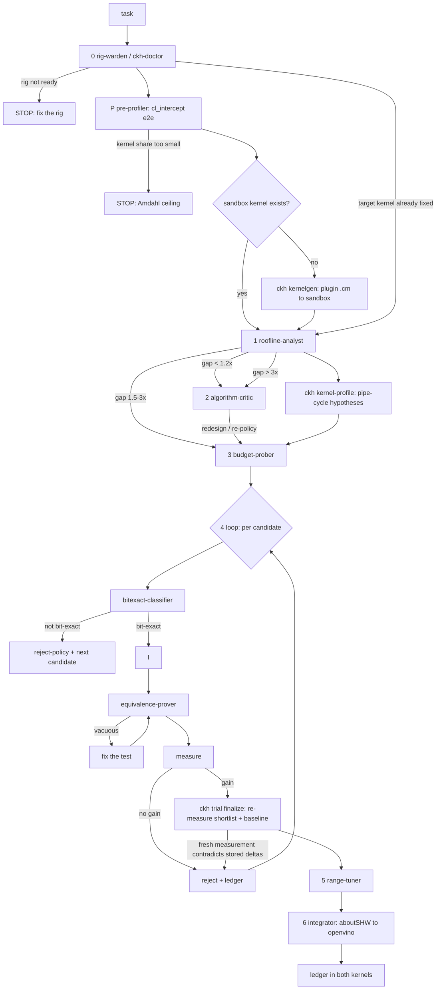

# CM kernel optimization — flow and artifacts

The declarative companion for this document is
`../../workflows/performance-optimization.workflow.yaml`. It binds the current runtime agents
under `.github/agents/` into a reference-harness-style role graph; this file remains the
human-readable explanation of the same gates, artifacts, and loop semantics.

## 1. Pipeline

Each phase's output decides whether the next one is worth running. The gates matter more than
the boxes: most of the value is in *not* proceeding.

```
         ┌──────────────────────────────────────────────┐
   task ────────────►│  0  rig-warden / ckh-doctor                 │
         │     competing GPU work? env? noise floor?    │
         └──────────────────────┬───────────────────────┘
       rig not ready ─────┴──► STOP: fix the rig
               │
               ▼
         ┌──────────────────────────────────────────────┐
         │  P  pre-profiler        (target kernel known? │
                     │     cl_intercept on the REAL pipeline   skip) │
                     │     prefill vs generate · per-kernel share    │
                     └──────────────────────┬───────────────────────┘
                                            │
            share too small ────────────────┴──► STOP: "Amdahl ceiling is N%"
                                            │
                                            ▼
                     ┌──────────────────────────────────────────────┐
                     │  1b ckh kernelgen            *** OPTIONAL *** │
                     │     only if the profiled kernel has no        │
                     │     sandbox copy yet. plugin .cm ──► sandbox  │
                     │     DERIVED sig/includes/-D · GUESS host jit  │
                     │     REFUSED inputs (test skips its launch)    │
                     └──────────────────────┬───────────────────────┘
                          already have one ─┴─► skip; point kernels/<n>.py at it
                                            │
                                            ▼
                     ┌──────────────────────────────────────────────┐
                     │  1  roofline-analyst                         │
                     │     MEASURED roofs (never spec sheets)       │
                     │     compulsory traffic vs algorithm artifact │
                     │     gap = current / floor                    │
                     └──────────────────────┬───────────────────────┘
                                            │
                ┌───────────────────────────┼───────────────────────────┐
            gap < 1.2x                  1.5 – 3x                    gap > 3x
                │                           │                           │
                ▼                           │                           ▼
     ┌────────────────────────┐             │            ┌────────────────────────┐
     │  2  algorithm-critic   │             │            │  2  algorithm-critic   │
     │     micro-opt is       │             │            │     artifacts dominate │
     │     exhausted          │             │            │     — suspect decomp   │
     └───────────┬────────────┘             │            └───────────┬────────────┘
                 │  redesign / re-policy    │                        │
                 └──────────────────────────┼────────────────────────┘
                                            ▼
                     ┌──────────────────────────────────────────────┐
                     │  3  budget-prober                            │
                     │     ablation budget, largest term first      │
                     │     self-check: probe cheaper than removed?  │
                     │     self-check: probe-off == baseline?       │
                     │  (ckh kernel-profile ranks candidates first, │
                     │   from the IGC dump, at no GPU cost)         │
                     └──────────────────────┬───────────────────────┘
                                            ▼
    ╔═══════════════════════════════════════════════════════════════════════════╗
    ║  4  optimization loop        (one candidate at a time, biggest term first) ║
    ║                                                                           ║
    ║     bitexact-classifier ──── bit-exact? ──── no ──► reject-policy          ║
    ║              │                                      + next candidate      ║
    ║              │ yes                                   not just the max)    ║
    ║              ▼                                                            ║
    ║        implement ──► equivalence-prover ──► measure ──► adopt             ║
    ║                            │                   │                          ║
    ║                    non-vacuous? ─ no ─►        │ no gain ─► REJECT        ║
    ║                    fix the TEST                │                          ║    ║                                                                           ║
    ║  ckh trial automates the bookkeeping: budgeted tree, per-node snapshot,    ║
    ║  gates in cost order, and a finalize that RE-MEASURES rather than trusting ║
    ║  stored deltas (they came from different moments on a drifting box).       ║    ╚════════════════════════════════════╤══════════════════════════════════════╝
                                         ▼
                     ┌──────────────────────────────────────────────┐
                     │  5  range-tuner                              │
                     │     calibrate over the DOMAIN, not a point   │
                     │     guard = relative property, same run      │
                     │     verify guard fails on the bad value      │
                     └──────────────────────┬───────────────────────┘
                                            ▼
                     ┌──────────────────────────────────────────────┐
                     │  6  integrator      aboutSHW ──► openvino    │
                     │     diff code-only (kernels DIFFER)          │
                     │     build · real model                       │
                     │     check text AND accepted-token count      │
                     └──────────────────────┬───────────────────────┘
                                            ▼
                          LEDGER ─ write results, including
                          negatives, into BOTH kernels' comments
```

Every arrow that leaves the happy path — STOP, REJECT, "fix the TEST", "ask user" — fired at
least once in the work this was distilled from.

## 2. Where things live and what is versioned

```
  aboutSHW/                                    ← versioned: method + kernel + findings
  ├── .github/agents/*.agent.md               the role definitions used by VS Code
  ├── docs/                                   OVERVIEW.md + this file + KERNEL_ONBOARDING.md
  ├── opencl/tests/pageatten/
  │   ├── harness/                             bench_paired · kernel_probe
  │   │   ├── sync.sh                          equiv_template · bench_reduce
  │   │   └── README.md
  │   ├── pa_small_q_ov_exp.cm                 sandbox kernel + LEDGER
  │   └── test_*.py                            correctness + perf guards
  │
  openvino/                                    ← versioned: production
  └── src/plugins/intel_gpu/.../cm/
      ├── pa_small_q.cm                        production kernel + LEDGER
      ├── pa_small_q_finalization.cm
      └── paged_attention{,_gen}.{cpp,hpp}     host policy, rung table
  │
  workflows/                                   ← versioned: declarative role graph
  /home/intel/ceciliapeng/kernel_harness/      ← NOT versioned (sync target, derived)
```

Two rules keep this from rotting:

- **Findings live in the kernel, not in chat.** Both `.cm` files carry a comment ledger with
  measured numbers. That convention predates this workflow and is what let a stale
  "+1 to +3%" verdict be identified as a rig artifact once a stable rig existed. Record
  negatives too, and say whether a change was rejected on *measurement* or on *policy*.
- **The two ledgers must not diverge.** When `integrator` ports a change, it ports the ledger
  entry with it.

## 3. Measurement loop (the part with the container)

```
   edit  aboutSHW/opencl/tests/pageatten/*.cm        (host, versioned)
     │
     ├─► harness/sync.sh [kernel.cm]
     │        └─► /home/intel/ceciliapeng/kernel_harness   (only path the container sees)
     │
     └─► docker exec llm bash -lc 'cd /ceciliapeng/bell/aboutSHW/... && python ...'
              └─► the container has its OWN copy of the kernel tree
                  ⇒ re-sync after EVERY edit or you measure the previous version
```

Bare metal is a fallback only (`LD_LIBRARY_PATH=/home/intel/river`), and its numbers are
provisional: it drifts ~2x within a session.

## 4. Mermaid (for docs/PRs)


